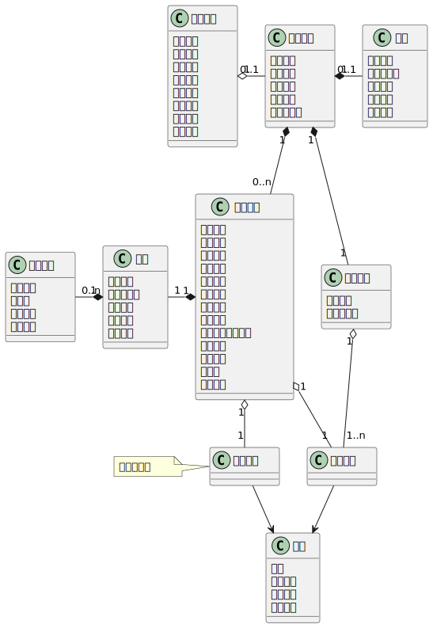
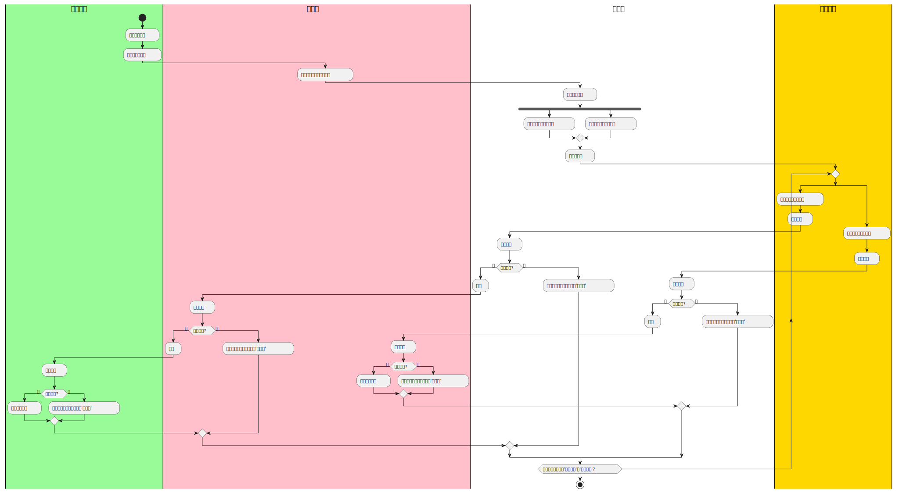
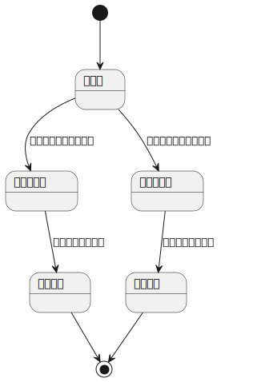

# INSPECFLOW

督察数据模型图如下：

督察业务流程图如下：

问题状态图如下：

## flowable-UI

- flowable项目代码下载 `https://github.com/flowable/flowable-engine/releases/tag/flowable-6.8.0` , 选择 **flowable-6.8.0.zip** 下载
- 解压以后，在 `/wars` 下找到两个war包，`flowable-rest.war` 和 `flowable-ui.war`
    - 在windows环境下，可以安装 tomcat，然后将这两个war包，放置在 `/webapps` 目录下，使用`/bin/startup.bat` 运行tomcat即可。
    - 在mac环境下，可以在vscode中安装插件，`Community Server Connector`，然后安装tomcat server 9.0.41，部署 `flowable-ui.war`，
    - 在网页端输入`localhost:8080/flowable-ui`，第一次登陆会需要输入账号密码，其中管理员 账号：`admin`，密码：`test`
    - 注意：flowable-6.8.0 的war包中springboot内置tomcat版本是**9.x**，所以使用的tomcat版本也一定要是**9.x**，不然就会一直报错 `404`

flowable-ui界面如下：

具体使用可以见开发者文档：`https://tkjohn.github.io/flowable-userguide/#flowableUIApps`
